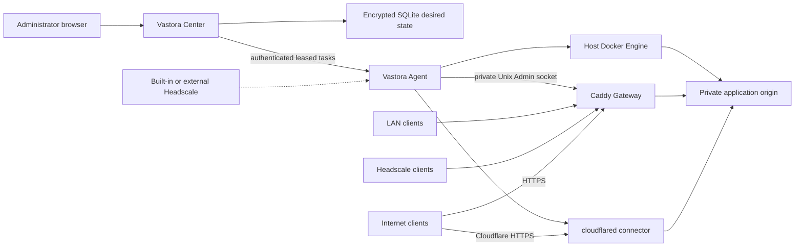

# Architecture

Vastora is a desired-state control plane for Docker applications across multiple
locations. Center is the only source of network and publication intent. Agent is
the only component that discovers local addresses and touches host Docker,
Caddy, cloudflared, or application-local APIs.

## Resource hierarchy

- An `Organization` owns `Site` records. The first release creates one local organization.
- A `Site` is a physical or logical location that groups nodes sharing local reachability and optional DNS defaults.
- A node is a managed host. The Vastora Agent on that host reports roles, executable capabilities, and locally assigned addresses.
- An `Application` is one catalog workload installed on one node. The same app can be installed once on each node.
- A `Service` is a private origin endpoint produced by an application. Installation never publishes it.
- A `Publication` is one access entry for one Service. A Service can have any number of independent Publications.
- A `Route` is the Caddy-specific realization of a Web Publication. It is not the source-of-truth service model.

There are three node network capabilities, and they are additive rather than
mutually exclusive: `lan`, `headscale`, and `public`. Cloudflare Tunnel is a
Service publication method, not a fourth network.

## Installation boundary

Center releases publish a fixed-name, checksummed deployment bundle containing
the guided setup, Compose and Headscale configuration, and an immutable Center
image reference. The public `install.sh center` bootstrap verifies and installs
that bundle; it never builds source on the user's server. Each running Center
then serves its own Agent installer and architecture-specific Agent binaries.
Agent enrollment, site assignment, roles, Headscale pre-authentication, and the
short-lived credential therefore remain specific to that Center instead of a
universal public Agent command.

## Address discovery and confirmation

Agent enumerates addresses assigned to local interfaces and reports
`NetworkCandidate` values. It never calls an external “what is my IP” service,
so a NAT egress address cannot be mistaken for an inbound public capability.
Center asks an administrator to confirm candidates into one `NetworkProfile`:

- the private address used by application origins;
- selected LAN, Headscale, and public addresses;
- enabled network capabilities;
- whether direct public ingress is explicitly allowed.

The private service address cannot change while applications are active. A
confirmed address or network capability cannot be removed while a Publication
still depends on it.

## Application and publication lifecycle

1. Center validates the signed catalog manifest and queues an Application task.
2. Agent starts the allowlisted Docker workload on the confirmed private service address.
3. Agent reports declared Service endpoints. Center validates protocol, ports, and address against the signed manifest and Network Profile.
4. The administrator independently adds one or more Publications to each Service.
5. LAN and Headscale Web Publications queue a complete Caddy desired state on the selected Site Gateway. Direct-public Web Publications use the public listener and force HTTPS.
6. Cloudflare Tunnel Publications update the remotely managed Tunnel ingress and DNS records, then queue a versioned cloudflared connector task on the selected node.
7. Gateway and Tunnel task results advance only the exact desired revision and claim attempt. DNS and reachability checks provide the final ready state where propagation is asynchronous.

Removing one Publication leaves sibling Publications and the private Service
running. Uninstall stops all Publications for the Application and removes their
routes; persistent volumes are retained unless the administrator explicitly
chooses permanent data deletion.

## Publication types

| Type | Services | Entry | Transport |
| --- | --- | --- | --- |
| `lan_gateway` | HTTP/HTTPS | selected Site Gateway with LAN address | HTTP by default on LAN |
| `headscale_gateway` | HTTP/HTTPS | selected Site Gateway with Headscale address | HTTP by default inside the tailnet |
| `public_direct` | Web or raw TCP/UDP | public Gateway for Web; application node for raw ports | HTTPS for Web; app-controlled raw protocol |
| `cloudflare_tunnel` | HTTP/HTTPS | selected Tunnel-capable node | Cloudflare HTTPS to a private origin |

Direct-public DNS managed through Cloudflare is always DNS-only. A standard
Cloudflare Tunnel is not offered for arbitrary VLESS/TCP/UDP clients. Raw 3x-ui
inbounds remain owned by 3x-ui; Vastora observes their protocol, port, listen
address, and reachability but does not rewrite them or manage nftables.

## Gateway and Tunnel desired state

Caddy receives explicit listeners for LAN, Headscale, and public addresses.
Routes reference exactly one listener kind, so the same hostname can be scoped
to separate private entry networks without a wildcard bind. Caddy has no Docker
socket; its Admin API is a permissioned Unix socket shared only with Agent.

Each Cloudflare entry node owns one remotely managed Tunnel. One Tunnel can
carry multiple Web ingress rules. Agent runs a fixed cloudflared image with host
networking. Removing the final ingress stops the connector but retains the
remote Tunnel until the administrator explicitly disconnects the integration.

## Headscale

The Center deployment stack includes Headscale as a separate fixed-version
service with its own persistent volume. Operators may instead connect an
existing HTTPS Headscale API. Center creates Vastora users/tags and one-hour,
single-use pre-auth keys, but it does not embed Headscale logic into the Center
process.

Built-in Headscale reads stable sorted A/AAAA records from a Center-generated
`dns.extra_records_path` file. External Headscale installations use manual DNS
unless that file is managed by the operator.

## 3x-ui

3x-ui uses host networking. On first install, Center generates a strong
administrator username/password and displays it once. Agent applies those
credentials locally, creates a local API token, and stores its copy encrypted.
Center stores its copy under the Application secret boundary.

Panel and subscription are separate Web Services. Agent reads enabled inbounds
through the local Bearer-token API on heartbeat and reports them as observed raw
Services. The panel is a management Service and cannot be published publicly
without explicit high-risk confirmation.

## Offline and backup boundaries

Agent persists the last successfully applied Gateway state and restores it
before contacting Center. Existing containers, Caddy routes, and connectors
continue while Center is unavailable; only desired-state changes pause.

Center backup contains Center SQLite and its encryption key. Agent credentials,
applied state, Headscale data, Caddy data, cloudflared runtime state, and
application volumes have separate host-local backup boundaries.

Vastora currently supports only its current schema. Structural changes require
rebuilding the development Center database and re-enrolling Agents; there are no
compatibility layers or in-place migrations during pre-alpha development.
