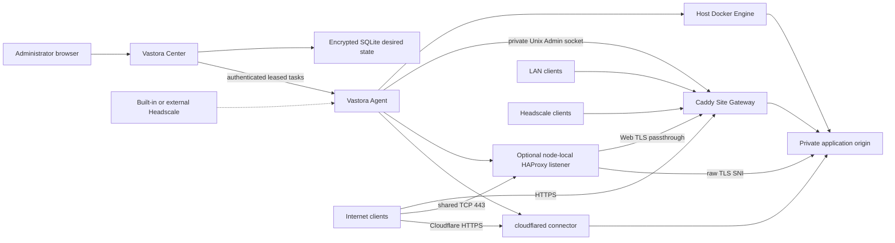

# Architecture

Vastora is a desired-state control plane for Docker applications across multiple
locations. Center is the only source of network and publication intent. Agent is
the only component that discovers local addresses and touches host Docker,
systemd-managed native probes, Caddy, optional HAProxy, cloudflared, or
application-local APIs.

Center database changes use ordered, forward-only SQLite migrations. Before an
existing database advances, Center creates a transactionally consistent
snapshot under its private data directory. Each migration runs in a transaction,
then Center verifies foreign keys and database integrity. Older Center binaries
refuse newer schemas; downgrades restore the pre-migration snapshot instead of
attempting a reverse migration.

## Resource hierarchy

- An `Organization` owns `Site` records. The first release creates one local organization.
- A `Site` is a physical or logical location that groups nodes sharing local reachability and optional DNS defaults.
- A node is a managed host. The Vastora Agent on that host reports roles, executable capabilities, and locally assigned addresses.
- An `Application` is one catalog workload installed on one node. The same app can be installed once on each node.
- A `Service` is a private origin endpoint produced by an application. Installation never publishes it.
- A `Publication` is one access entry for one Service. A Service can have any number of independent Publications.
- A `Route` is the Caddy-specific realization of a Web Publication. It is not the source-of-truth service model.

Catalog sources are independent namespaces. The built-in `vastora-official`
source is read-only; administrators may manage additional signed HTTPS sources.
Center performs manual and scheduled refresh through one lifecycle service. A
verified refresh atomically checks permanent source/app/version manifest
history and swaps the last-good cache. Each source lifetime has a random,
non-reusable generation, so an in-flight response cannot cross a delete and
recreate boundary. Disabled sources do not refresh or offer
new installations, while installed applications retain their saved manifest so
they remain configurable and uninstallable after a source is disabled or
deleted.

Agent enrollment consumes a ten-minute token transactionally and registers a
long-lived X25519 public key. The Agent records the matching private key under
its local encryption key and pins the verified TLS trust-anchor public key for
the Center URL. Center encrypts each complete leased task with a fresh ephemeral
X25519 key and binds the envelope to Agent ID, task ID, and lease attempt. Agent
writes a durable receipt before applying the task and a locally encrypted result
outbox before acknowledgement; replay after a disconnect or restart reuses the
recorded result instead of repeating a completed effect. Credential revocation
is an immediate control-plane action independent of application removal or node
disable, and wakes active long polls so revoked Agents cannot claim or
acknowledge tasks.

There are three node network capabilities, and they are additive rather than
mutually exclusive: `lan`, `headscale`, and `public`. Cloudflare Tunnel is a
Service publication method, not a fourth network.

## Installation boundary

Center releases publish a fixed-name, checksummed deployment bundle containing
the guided setup, Compose and Headscale configuration, and an immutable Center
image reference. The public `install.sh center` bootstrap verifies and installs
that bundle; it never builds source on the user's server. Center initially maps
only to the server loopback interface, and the administrator opens the first-run
wizard through an SSH tunnel. Domain, TLS, Headscale, and public Gateway setup
therefore do not block installation or claim public port 443. Each running
Center serves the same Agent installer plus both `linux/amd64` and
`linux/arm64` Agent binaries. A Center on either architecture can therefore
manage a mixed x64 and ARM64 Site; the installer and self-updater select the
node's native binary and reject unsupported platforms.
The Agent installer and Center-hosted Docker installer detect `/etc/os-release` on
the target server, not the administrator's browser or the Center host. They
accept Debian 12/13 and Ubuntu 22.04/24.04/26.04 with `amd64` or `arm64` userland
architecture reported by `dpkg`. Debian 11, older Ubuntu releases, derivatives,
and unlisted releases stop before package or Agent changes. Docker and
Tailscale repositories use the selected distribution's official release
codename; no cross-distribution repository fallback is allowed. The Docker
installer leaves existing Docker installations in place and reports conflicting
packages rather than removing them. Existing Tailscale installations retain
their ownership and go through the shared compatibility check; they are not
automatically replaced or downgraded.
Official Catalog and infrastructure images must publish both Linux platforms.
CI resolves every pinned runtime image and fails before merge if either
`linux/amd64` or `linux/arm64` is missing; production never relies on emulation.
The administrator chooses the node name, site, purpose, and connection method
before Center issues a short-lived credential. Center binds those choices to
the credential and returns an authenticated installer, so the copied command
does not expose editable role, capability, or Headscale arguments. Enrollment
and its bootstrap material remain specific to that Center instead of a
universal public Agent command.

A host may run Center and Agent together; this is a first-class Vastora
deployment, not a development-only exception. Center remains the desired-state
control plane while the host Agent remains the only component that manages
applications and gateway state. Bundled Headscale runs in its own Docker network
namespace and publishes only its HTTP control port on host loopback. The host
Tailscale client therefore owns `tailscale0` without sharing a network namespace
with the Headscale server process. The bundled HTTPS gateway binds only to
loopback and public addresses that both resolve from its configured hostnames
and exist on the server, leaving LAN and Tailscale addresses available to the
co-located Agent gateway. The deployment helper bootstraps the same canonical
Caddy container and private Admin socket that Agent later adopts; it never
creates a second Center-only Caddy. Center and Headscale are protected system
routes in every complete desired state for that host, so application changes or
removing the node from a Site Gateway role cannot erase the control plane.
Center records the bundled infrastructure
specification version and asks the restricted deployment helper to reconcile an
older installation once after an upgrade; persistent Headscale data and the
existing encrypted API key are retained.

Center exposes separate liveness and startup-readiness probes. The official
upgrader waits for built-in Headscale reconciliation before restarting a
co-located Agent, allowing the Agent to restore Caddy and HAProxy state without
depending on the private Center route during the gateway handoff.

## Address discovery and confirmation

Agent enumerates addresses assigned to local interfaces and reports
`NetworkCandidate` values. It never calls an external “what is my IP” service,
so a NAT egress address cannot be mistaken for an inbound public capability.
Center asks an administrator to confirm candidates into one `NetworkProfile`:

- the private address used by application origins;
- selected LAN, Headscale, and public addresses;
- enabled network capabilities;
- whether direct public ingress is explicitly allowed.

The private service address cannot change while applications are active. A
confirmed address or network capability cannot be removed while a Publication
still depends on it.

## Application and publication lifecycle

1. Center validates the signed catalog manifest and queues an Application task.
2. Agent starts the allowlisted Docker workload on the confirmed private service address, or installs a platform-pinned native probe through its typed systemd executor.
3. Agent reports declared Service endpoints. Center validates protocol, ports, and address against the signed manifest and Network Profile.
4. The administrator independently adds one or more Publications to each Service.
5. LAN, Headscale, and direct-public Web Publications queue a complete Caddy desired state on the selected Site Gateway. A node-direct protocol Publication instead queues an independent listener desired state on the Application Node; callers cannot redirect it through another Site Gateway.
6. Cloudflare Tunnel Publications update the remotely managed Tunnel ingress and DNS records, then queue a versioned cloudflared connector task on the selected node. The connector reaches the Service directly over the validated private path; it does not require that node to be a Site Gateway or route through Caddy.
7. Gateway and Tunnel task results advance only the exact desired revision and claim attempt. DNS and reachability checks provide the final ready state where propagation is asynchronous.

The optional Center remote fallback is separate from application publications.
It uses the first-level `center-vastora.<zone>` hostname so Cloudflare Universal
SSL covers the browser entry even when the private Center address lives under a
multi-level service namespace. Center creates a dedicated Cloudflare Access
application and policy first,
configures a dedicated remotely managed Tunnel to
`http://vastora-center:8080`, asks the restricted local deployer to start the
fixed cloudflared image on `vastora-runtime`, and publishes the proxied CNAME
last. Cleanup removes DNS first and stops the connector before deleting the
Access application and Tunnel. Agent control APIs never share this interactive
browser entry.

Removing one Publication leaves sibling Publications and the private Service
running. Uninstall stops all Publications for the Application and removes their
routes; persistent volumes are retained unless the administrator explicitly
chooses permanent data deletion.

When an Agent release changes the runtime contract, it reports a monotonic
runtime generation. Center then queues one forward reconciliation of every
running application plus that node's Site Gateway, node-listener, and Tunnel desired state. A
successful task records the new generation; failed tasks retain their data and
remain visible in Actions. This is also the one-time migration from the former
host-network containers to the shared bridge. The Komari migration installs the
verified native binary and `0600` JSON configuration first, verifies its systemd
service, and only then removes the obsolete Docker container.

## Publication types

| Type | Services | Entry | Transport |
| --- | --- | --- | --- |
| `lan_gateway` | HTTP/HTTPS | selected Site Gateway with LAN address | HTTP by default; optional public-trust HTTPS through Cloudflare DNS-01 |
| `headscale_gateway` | HTTP/HTTPS | selected Site Gateway with Headscale address | HTTP by default; optional public-trust HTTPS through Cloudflare DNS-01 |
| `public_direct` | Web or raw TCP/UDP | public Site Gateway for Web; application node for raw ports | HTTPS for Web; app-controlled raw protocol |
| `public_shared_443` | raw TLS-over-TCP with a distinct protocol SNI | Application Node only | exact DNS-only record targets that node; its local HAProxy routes the separately stored protocol SNI on public 443 |
| `cloudflare_tunnel` | HTTP/HTTPS | selected Tunnel-capable node | Cloudflare HTTPS to a private origin |

Direct-public DNS managed through Cloudflare is always DNS-only. A standard
Cloudflare Tunnel is not offered for arbitrary VLESS/TCP/UDP clients. Raw 3x-ui
inbounds remain owned by 3x-ui. Vastora can request a new VLESS REALITY inbound
through Agent's node-local API, then observes its protocol, transport, security,
port, listen address, and reachability without managing nftables.

## Site Gateway, node-listener, and Tunnel desired state

Caddy receives explicit listeners for LAN, Headscale, public, and control-plane
loopback addresses. For bundled infrastructure, Headscale is the only public
HTTPS service. Center binds its Web route to the co-located node's Headscale
address and uses a Cloudflare DNS-01 certificate. The public Headscale hostname
also exposes only `/install/docker.sh`, `/install/agent.sh`,
`/api/v1/agent-binaries/*`, and `/api/v1/agent-decommission-results/*` to
Center. The Docker path serves a static installer with no credentials; Agent
profile and binary downloads require a short-lived one-time token. A
decommission result requires the separate token bound to that exact cleanup
task and attempt; it cannot call any other Center API.
Routes reference exactly one listener kind, so the same hostname can be scoped
to separate private entry networks without a wildcard bind. Caddy has no Docker
socket; its Admin API is a permissioned Unix socket shared only with Agent.

Each host has at most one Vastora-managed Caddy. On a Center-plus-Agent host the
deployment helper creates it during built-in Headscale setup, and Agent adopts
it when the node becomes a Gateway. A forward runtime migration stops and
removes the former Center-only Caddy only after the unified gateway passes both
Center and Headscale HTTPS health checks; failure restarts the preserved prior
containers. Caddy remains the sole Web TLS terminator.

The first Agent in a bundled-Headscale installation runs on the Center host. It
uses loopback for enrollment, joins Headscale, and reports the host's private
address. Center then writes its own hostname into Headscale extra DNS and moves
the canonical Caddy route onto that address. Later nodes fetch the token-bound
installer from the public Headscale hostname, join the private network, and only
then contact Center.

HAProxy is absent by default. A `public_shared_443` Publication creates an
independently versioned node-listener state on its Application Node. A VLESS-only
node runs HAProxy without Caddy and rejects unmatched SNI. When the Application
Node is also a Site Gateway, Docker moves Caddy behind the same HAProxy; exact
protocol SNI goes to the local application and unmatched Web TLS goes to local
Caddy through `vastora-runtime`. Removing the final node-direct 443 Publication
removes HAProxy and restores Caddy's public binding on a dual-role node. Services
without a distinct TLS SNI must use another port or public address.

The schema-56 cutover is two phase and durable. Center first queues the complete
node-listener state on every replacement Application Node and keeps the legacy
Site Gateway state active. Only an acknowledged node-listener revision plus a
successful exact-DNS and exact-SNI external probe permits Center to queue the
legacy Gateway revision that removes the old shared-443 route. Until then the
migrated Publication stays pending rather than reporting a false ready state.
Entries that cannot satisfy the new node-local prerequisites are stopped with
`action_required`; their legacy Gateway state is retired through the same
desired-state path instead of being silently reinterpreted.

Center and Agent both reject a managed REALITY route unless it resolves to that
same node's `vastora-3x-ui:443` endpoint with Proxy Protocol v2. The Agent reads
the live HAProxy configuration back from the running container and reports the
listener healthy only when its content hash matches the desired revision. Center
then performs an exact-SNI TLS 1.3 handshake before marking the Publication ready.

Each Cloudflare entry node owns one remotely managed Tunnel. One Tunnel can
carry multiple Web ingress rules. Agent runs the fixed cloudflared image on the
private runtime bridge and forwards each hostname directly to its validated Web
Service origin. The Tunnel connector role is independent from the Site Gateway
role. During the schema-56 migration, Center applies and externally verifies
the direct connector target before removing the former loopback Caddy route;
the existing Tunnel and DNS identity are preserved throughout the cutover.
Removing the final ingress stops the connector but retains the remote Tunnel
until the administrator explicitly disconnects the integration.

## Headscale

The Center deployment stack includes Headscale as a separate fixed-version
service with its own persistent volume. Operators may instead connect an
existing HTTPS Headscale API. Center creates Vastora users/tags and one-hour,
single-use pre-auth keys, but it does not embed Headscale logic into the Center
process.

Bundled Headscale runs an authenticated embedded DERP relay and advertises no
Tailscale-operated DERP regions. Its static custom DERP map also contains
`stun.cloudflare.com:3478/udp` as a `STUNOnly` node. Cloudflare therefore helps
clients discover NAT mappings, but it never carries Vastora DERP, TURN, or
application traffic. Direct peer-to-peer WireGuard paths remain the preferred
data path; nodes fall back only to the bundled relay. Headscale update checks,
remote DERP-map updates, Logtail, and client auto-update instructions are
disabled. Vastora-managed Linux Tailscale services also opt out of Tailscale
log upload through a systemd override that Agent install and upgrade reconcile
idempotently. Agent also checks the live local DERP map before committing the
applied isolation marker and retries unexpected topology on the next heartbeat.
Operators should allow UDP 3478 for effective NAT discovery.
Cloudflare may observe the STUN probe's source IP, source port, and timing.

An optional fixed public endpoint can improve direct connectivity on a Center
host with a reserved public IPv4 and a stable UDP `41641` mapping. It is off by
default and can be enabled only through the first-run advanced settings or the
Network page with an explicit mapping confirmation. Center stores the choice
and sends it only to the single active, co-located Vastora-managed Agent. Agent
uses the shared minimum-version and capability policy, writes a dedicated
configuration and systemd drop-in atomically, restarts and checks the daemon and UDP listener, and rolls
back both files on failure. Every heartbeat also checks the live session,
loaded systemd environment, and UDP listener even when the managed files are
unchanged; runtime drift triggers a managed restart. Disabling the option
removes only Vastora-owned files. External Headscale and user-managed Tailscale
installations never receive or display this setting. Public HTTP/HTTPS
reachability is not treated as proof that UDP `41641` works.

The default Tailscale installation pin is separate from the compatibility floor.
An existing supported stable client is reused without package replacement or an
implicit ownership change. Installer preflight, fixed-endpoint reconciliation,
and explicit legacy adoption share the same policy; runtime checks also inspect
the daemon rather than trusting the CLI version. See
[Tailscale compatibility](tailscale-compatibility.md) for version formats,
capability checks, ownership proof, and the remaining real-release CI gate.

The strict no-external-telemetry boundary applies to Vastora-managed Linux
`tailscaled`. Tailscale's macOS GUI clients do not support the equivalent opt-out;
operators requiring the same assurance on macOS must use the open-source CLI
daemon or enforce an outbound allowlist.

The Center host may also be an application node. In that topology its Agent and
Tailscale client run natively, while Center, Deployer, Headscale, Caddy and
HAProxy use the shared private Docker bridge. Only explicitly owned host ports
are published. Vastora does not require a dedicated Center-only machine.

Vastora-managed networking is IPv4-only. Agents report only IPv4 candidates,
built-in Headscale allocates only `100.64.0.0/10` addresses, and managed DNS,
gateway listeners, publications, and application upstreams use IPv4 addresses.

Bundled setup starts Headscale's Caddy HTTPS entry on public ports `80` and
`443`. Center uses the same Caddy process but only its loopback and Headscale
listeners; it has no public DNS record or public application route. Caddy uses
separate internal container ports for public, Headscale, LAN and loopback
listeners, so identical host ports retain their network-specific policy.

Built-in Headscale reads stable sorted A records from a Center-generated
`dns.extra_records_path` file. External Headscale installations use manual DNS
unless that file is managed by the operator.

Bundled Headscale enables tailnet DNS override with fixed Cloudflare upstream
resolvers. Extra records such as the private Center hostname are therefore
available through the operating system resolver, while unrelated queries are
forwarded normally.

## 3x-ui

Center owns exactly one global 3x-ui subscription control plane across all
Sites. The selected controller owns the client database, administrator panel,
subscription service, credentials, restore points, and controller replacement
workflow. Every other 3x-ui installation is a VLESS worker, even when it belongs
to another Site; Site remains a geographic and ingress boundary rather than a
subscription ownership boundary. Workers reach the controller over their
confirmed Headscale/Tailscale or private service address, while each worker's
REALITY traffic still enters directly through that worker's own public address
and node-local HAProxy.

The forward migration from legacy per-Site controllers records one canonical
controller deterministically, preferring connected workers and existing
panel/subscription publications. During Alpha, Center then processes each extra
controller sequentially: it stores a fresh encrypted 3x-ui database restore
point, switches that host and its former workers to the global controller,
reconciles them one at a time, and only then retires the obsolete panel and
subscription publications. Existing clients, inbounds, or remote-node rows do
not block this Alpha conversion. Durable migration and Agent task state allow a
restart to resume without running two conversions concurrently; a failed host
stops the sequence for explicit recovery.

3x-ui uses the private runtime bridge. Docker publishes the panel and the
global controller subscription service only on a confirmed loopback, LAN, or
Headscale/Tailscale address; a public-only service address fails closed. Each
physical VLESS node exposes exactly one REALITY socket, `443`, only inside the
shared Docker network. Its local HAProxy is the sole public listener and
forwards an allowlisted REALITY SNI to `vastora-3x-ui:443`. The raw 3x-ui socket
is never published on the host. On first
install, Center generates a strong administrator username/password and displays
it once. Agent applies those credentials locally, creates a local API token,
and stores its copy encrypted. Center stores its copy under the Application
secret boundary.

Panel and subscription are separate Web Services. Agent reads enabled inbounds
through the local Bearer-token API on heartbeat and reports them as observed raw
Services. The panel is a management Service and cannot be published publicly
without explicit high-risk confirmation.

The subscription Service has a dedicated one-click public workflow. Center
creates only a public HTTPS Publication for that Service, then sends a typed
command to the application Agent to update 3x-ui's `subDomain` and `subURI`.
The management panel remains private and is never included implicitly. Each
client's full subscription URL continues to be generated by 3x-ui with its own
subscription identifier.

For browser-trusted private HTTPS, Center completes ACME DNS-01 validation with
the connected Cloudflare zone. The certificate and key are encrypted in Center,
sent only in the claimed Gateway task, encrypted again in the Agent's local
last-known-good store, and loaded into Caddy over its private Admin socket.
Certificate renewal queues a new full Gateway revision before the old encrypted
certificate is removed.

The one-click REALITY flow is an authenticated, leased Application command.
Center owns the subscription-facing node name and composes it from a structured
ISO 3166-1 region plus the administrator-provided name (for example,
`🇺🇸 US · Oracle 9929`). The region can be suggested from the VLESS node's own
public address and remains manually searchable and editable. This keeps client
grouping prefixes stable while the global 3x-ui controller manages nodes across
Sites.
The administrator must provide a `.com` `targetHost` and exact `.com`
`serverName`; target port is fixed to 443. Agent resolves the target, pins one
IP, rejects addresses identified by cdncheck as shared CDN or WAF infrastructure,
and verifies TLS 1.3, X25519, H2, SNI, and the certificate against that pinned IP.
ASN is advisory metadata, not an authorization boundary: different ASNs are
allowed. After the security checks, node and target ASN lookups each have a
one-second deadline. Missing or failed lookups return `0` (unknown), never
block creation or trigger quarantine, and are displayed as unknown rather than
AS0. Center uses the same target-proof predicate for verify, create, and harden.
Known shared CDN/WAF targets remain rejected because fixed IP plus an outer
SNI allowlist does not prove cross-tenant isolation; no override is offered.
It then generates the keys and optional
first client locally and creates the node's sole REALITY inbound on container
port `443`. Later subscribers are clients of that inbound rather than new
inbounds.

Each physical 3x-ui host can have only one managed REALITY inbound. REALITY
points directly at the validated pinned IP on port 443 and permits exactly the
verified `serverName`. The node-local HAProxy accepts that exact outer SNI,
forwards Proxy Protocol v2 to the local 3x-ui `:443`, and rejects unmatched SNI
on VLESS-only nodes. A dual-role Site Gateway sends unmatched SNI only to its
local Caddy. This blocks the usual alternate-SNI relay path, but SNI is not
client authentication. TCP passthrough cannot authorize encrypted HTTP Host
values or an ECH inner ClientHello. Unauthenticated connections with the
allowed SNI may still reach the pinned fallback site and consume node traffic.
The guard restricts fallback destinations; it does not promise zero anonymous
traffic, complete CDN detection, or volumetric DDoS protection. During upgrade,
Agent removes the obsolete loopback `tunnel` inbound and reserved Xray routes
only after the main REALITY inbound has passed disabled and enabled read-back.

Center records this proof in `three_x_ui_reality_guards`. A service whose guard
is not `ready` cannot create or recover a Publication. Center then creates a
`public_shared_443` Publication on that same node; supplying another entry node is
rejected because it would create a cross-node VLESS relay. The connection
hostname resolves to the VLESS node's public address, while its camouflage SNI
is the separate local HAProxy routing key. The generated VLESS URI is
encrypted at rest and can be revealed only once. Existing pre-guard services
are unpublished first and remain `action_required` until their original inbound
is disabled, validated, converted, and read back. External 443,
keys, short IDs, clients, and subscription identity are unchanged.

## Offline and backup boundaries

Agent persists the last successfully applied Site Gateway and node-listener
states and restores them before contacting Center. Existing containers, Caddy
routes, and connectors continue while Center is unavailable; only desired-state
changes pause.

Center backup contains a consistent Center SQLite snapshot and its encryption
key. ACME account keys and certificates are encrypted records in that snapshot,
so no separate control-plane CA file exists. Restore requires an equivalent
Vastora version and an empty Center data directory. Agent credentials, applied
state, Headscale data, Caddy data, cloudflared runtime state, and application
volumes have separate host-local backup boundaries.

Released and pre-alpha Center schemas follow the same rule: structural changes
advance through tested, forward-only migrations after Center creates a backup.
Vastora does not retain obsolete compatibility layers or implement automatic
database downgrades. Rebuilding a development database remains an explicit
operator choice, not a substitute for a required migration.
