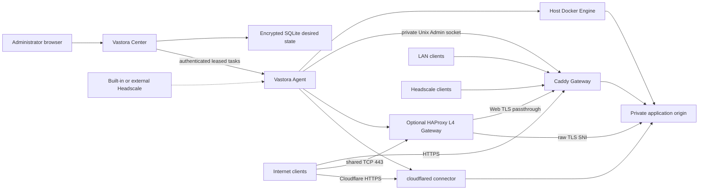

# Architecture

Vastora is a desired-state control plane for Docker applications across multiple
locations. Center is the only source of network and publication intent. Agent is
the only component that discovers local addresses and touches host Docker,
Caddy, optional HAProxy, cloudflared, or application-local APIs.

Center database changes use ordered, forward-only SQLite migrations. Before an
existing database advances, Center creates a transactionally consistent
snapshot under its private data directory. Each migration runs in a transaction,
then Center verifies foreign keys and database integrity. Older Center binaries
refuse newer schemas; downgrades restore the pre-migration snapshot instead of
attempting a reverse migration.

## Resource hierarchy

- An `Organization` owns `Site` records. The first release creates one local organization.
- A `Site` is a physical or logical location that groups nodes sharing local reachability and optional DNS defaults.
- A node is a managed host. The Vastora Agent on that host reports roles, executable capabilities, and locally assigned addresses.
- An `Application` is one catalog workload installed on one node. The same app can be installed once on each node.
- A `Service` is a private origin endpoint produced by an application. Installation never publishes it.
- A `Publication` is one access entry for one Service. A Service can have any number of independent Publications.
- A `Route` is the Caddy-specific realization of a Web Publication. It is not the source-of-truth service model.

There are three node network capabilities, and they are additive rather than
mutually exclusive: `lan`, `headscale`, and `public`. Cloudflare Tunnel is a
Service publication method, not a fourth network.

## Installation boundary

Center releases publish a fixed-name, checksummed deployment bundle containing
the guided setup, Compose and Headscale configuration, and an immutable Center
image reference. The public `install.sh center` bootstrap verifies and installs
that bundle; it never builds source on the user's server. Center initially maps
only to the server loopback interface, and the administrator opens the first-run
wizard through an SSH tunnel. Domain, TLS, Headscale, and public Gateway setup
therefore do not block installation or claim public port 443. Each running
Center serves the same Agent installer plus both `linux/amd64` and
`linux/arm64` Agent binaries. A Center on either architecture can therefore
manage a mixed x64 and ARM64 Site; the installer and self-updater select the
node's native binary and reject unsupported platforms.
Official Catalog and infrastructure images must publish both Linux platforms.
CI resolves every pinned runtime image and fails before merge if either
`linux/amd64` or `linux/arm64` is missing; production never relies on emulation.
The administrator chooses the node name, site, purpose, and connection method
before Center issues a short-lived credential. Center binds those choices to
the credential and returns an authenticated installer, so the copied command
does not expose editable role, capability, or Headscale arguments. Enrollment
and its bootstrap material remain specific to that Center instead of a
universal public Agent command.

A host may run Center and Agent together; this is a first-class Vastora
deployment, not a development-only exception. Center remains the desired-state
control plane while the host Agent remains the only component that manages
applications and gateway state. Bundled Headscale runs in its own Docker network
namespace and publishes only its HTTP control port on host loopback. The host
Tailscale client therefore owns `tailscale0` without sharing a network namespace
with the Headscale server process. The bundled HTTPS gateway binds only to
loopback and public addresses that both resolve from its configured hostnames
and exist on the server, leaving LAN and Tailscale addresses available to the
co-located Agent gateway. The deployment helper bootstraps the same canonical
Caddy container and private Admin socket that Agent later adopts; it never
creates a second Center-only Caddy. Center and Headscale are protected system
routes in every complete desired state for that host, so application changes or
removing the node from a Site Gateway role cannot erase the control plane.
Center records the bundled infrastructure
specification version and asks the restricted deployment helper to reconcile an
older installation once after an upgrade; persistent Headscale data and the
existing encrypted API key are retained.

Center exposes separate liveness and startup-readiness probes. The official
upgrader waits for built-in Headscale reconciliation before restarting a
co-located Agent, allowing the Agent to restore Caddy and HAProxy state without
depending on the private Center route during the gateway handoff.

## Address discovery and confirmation

Agent enumerates addresses assigned to local interfaces and reports
`NetworkCandidate` values. It never calls an external “what is my IP” service,
so a NAT egress address cannot be mistaken for an inbound public capability.
Center asks an administrator to confirm candidates into one `NetworkProfile`:

- the private address used by application origins;
- selected LAN, Headscale, and public addresses;
- enabled network capabilities;
- whether direct public ingress is explicitly allowed.

The private service address cannot change while applications are active. A
confirmed address or network capability cannot be removed while a Publication
still depends on it.

## Application and publication lifecycle

1. Center validates the signed catalog manifest and queues an Application task.
2. Agent starts the allowlisted Docker workload on the confirmed private service address.
3. Agent reports declared Service endpoints. Center validates protocol, ports, and address against the signed manifest and Network Profile.
4. The administrator independently adds one or more Publications to each Service.
5. LAN and Headscale Web Publications queue a complete Caddy desired state on the selected Site Gateway. They use HTTP by default, or browser-trusted HTTPS when the user enables Cloudflare DNS-01 certificate management. Direct-public Web Publications use the public listener and force HTTPS. A shared-443 raw TCP Publication additionally places HAProxy in front of Caddy on that Gateway.
6. Cloudflare Tunnel Publications update the remotely managed Tunnel ingress and DNS records, then queue a versioned cloudflared connector task on the selected node.
7. Gateway and Tunnel task results advance only the exact desired revision and claim attempt. DNS and reachability checks provide the final ready state where propagation is asynchronous.

Removing one Publication leaves sibling Publications and the private Service
running. Uninstall stops all Publications for the Application and removes their
routes; persistent volumes are retained unless the administrator explicitly
chooses permanent data deletion.

## Publication types

| Type | Services | Entry | Transport |
| --- | --- | --- | --- |
| `lan_gateway` | HTTP/HTTPS | selected Site Gateway with LAN address | HTTP by default; optional public-trust HTTPS through Cloudflare DNS-01 |
| `headscale_gateway` | HTTP/HTTPS | selected Site Gateway with Headscale address | HTTP by default; optional public-trust HTTPS through Cloudflare DNS-01 |
| `public_direct` | Web or raw TCP/UDP | public Gateway for Web; application node for raw ports | HTTPS for Web; app-controlled raw protocol |
| `public_shared_443` | raw TLS-over-TCP with a distinct protocol SNI | selected public Site Gateway | DNS uses the connection hostname; HAProxy routes the separately stored protocol SNI on public 443; Caddy retains Web TLS |
| `cloudflare_tunnel` | HTTP/HTTPS | selected Tunnel-capable node | Cloudflare HTTPS to a private origin |

Direct-public DNS managed through Cloudflare is always DNS-only. A standard
Cloudflare Tunnel is not offered for arbitrary VLESS/TCP/UDP clients. Raw 3x-ui
inbounds remain owned by 3x-ui. Vastora can request a new VLESS REALITY inbound
through Agent's node-local API, then observes its protocol, transport, security,
port, listen address, and reachability without managing nftables.

## Gateway and Tunnel desired state

Caddy receives explicit listeners for LAN, Headscale, public, and control-plane
loopback addresses. For bundled infrastructure, Headscale is the only public
HTTPS service. Center binds its Web route to the co-located node's Headscale
address and uses a Cloudflare DNS-01 certificate. The public Headscale hostname
also exposes only the exact `/install/agent.sh` bootstrap path to Center; the
short-lived enrollment token is still required before any private bootstrap
material is returned.
Routes reference exactly one listener kind, so the same hostname can be scoped
to separate private entry networks without a wildcard bind. Caddy has no Docker
socket; its Admin API is a permissioned Unix socket shared only with Agent.

Each host has at most one Vastora-managed Caddy. On a Center-plus-Agent host the
deployment helper creates it during built-in Headscale setup, and Agent adopts
it when the node becomes a Gateway. A forward runtime migration stops and
removes the former Center-only Caddy only after the unified gateway passes both
Center and Headscale HTTPS health checks; failure restarts the preserved prior
containers. Caddy remains the sole Web TLS terminator.

The first Agent in a bundled-Headscale installation runs on the Center host. It
uses loopback for enrollment, joins Headscale, and reports the host's private
address. Center then writes its own hostname into Headscale extra DNS and moves
the canonical Caddy route onto that address. Later nodes fetch the token-bound
installer from the public Headscale hostname, join the private network, and only
then contact Center.

HAProxy is absent by default. When at least one `public_shared_443` Publication
exists, Agent moves Caddy's public HTTPS listener to loopback `8443`, starts a
fixed, digest-pinned HAProxy container on the confirmed public address at `443`,
and routes explicitly configured SNI hostnames to raw TCP origins. All remaining
Web TLS passes through untouched to Caddy, which continues to obtain certificates
and terminate HTTPS. Removing the final shared-443 Publication removes HAProxy
and returns public `443` directly to Caddy. Services without a distinct TLS SNI
must use another port or public address.

Each Cloudflare entry node owns one remotely managed Tunnel. One Tunnel can
carry multiple Web ingress rules. Agent runs a fixed cloudflared image with host
networking. Removing the final ingress stops the connector but retains the
remote Tunnel until the administrator explicitly disconnects the integration.

## Headscale

The Center deployment stack includes Headscale as a separate fixed-version
service with its own persistent volume. Operators may instead connect an
existing HTTPS Headscale API. Center creates Vastora users/tags and one-hour,
single-use pre-auth keys, but it does not embed Headscale logic into the Center
process.

Bundled Headscale runs an authenticated embedded DERP relay and advertises no
Tailscale-operated DERP regions. Direct peer-to-peer WireGuard paths remain the
preferred data path; nodes fall back only to the bundled relay. Headscale
update checks, remote DERP-map updates, Logtail, and client auto-update
instructions are disabled. Vastora-managed Linux Tailscale services also opt
out of Tailscale log upload through a systemd override that Agent install and
upgrade reconcile idempotently. The embedded STUN listener uses UDP 3478, which
operators must allow through both host and provider firewalls for effective NAT
discovery.

The strict no-external-telemetry boundary applies to Vastora-managed Linux
`tailscaled`. Tailscale's macOS GUI clients do not support the equivalent opt-out;
operators requiring the same assurance on macOS must use the open-source CLI
daemon or enforce an outbound allowlist.

The Center host may also be an application node. In that topology its Agent and
Tailscale client run on the host, while bundled Headscale stays container-network
isolated and is reached only through the loopback-bound control port and the
shared HTTPS gateway. Vastora does not require a dedicated Center-only machine.

Vastora-managed networking is IPv4-only. Agents report only IPv4 candidates,
built-in Headscale allocates only `100.64.0.0/10` addresses, and managed DNS,
gateway listeners, publications, and application upstreams use IPv4 addresses.

Bundled setup starts Headscale's Caddy HTTPS entry on public ports `80` and
`443`. Center uses the same Caddy process but only its loopback and Headscale
listeners; it has no public DNS record or public application route. Loopback
`8443` is only an internal Caddy backend when an Agent enables the optional
shared-443 HAProxy frontend; it is never an administrator-facing service URL.

Built-in Headscale reads stable sorted A records from a Center-generated
`dns.extra_records_path` file. External Headscale installations use manual DNS
unless that file is managed by the operator.

Bundled Headscale enables tailnet DNS override with fixed Cloudflare upstream
resolvers. Extra records such as the private Center hostname are therefore
available through the operating system resolver, while unrelated queries are
forwarded normally.

## 3x-ui

3x-ui uses host networking. On first install, Center generates a strong
administrator username/password and displays it once. Agent applies those
credentials locally, creates a local API token, and stores its copy encrypted.
Center stores its copy under the Application secret boundary.

Panel and subscription are separate Web Services. Agent reads enabled inbounds
through the local Bearer-token API on heartbeat and reports them as observed raw
Services. The panel is a management Service and cannot be published publicly
without explicit high-risk confirmation.

The subscription Service has a dedicated one-click public workflow. Center
creates only a public HTTPS Publication for that Service, then sends a typed
command to the application Agent to update 3x-ui's `subDomain` and `subURI`.
The management panel remains private and is never included implicitly. Each
client's full subscription URL continues to be generated by 3x-ui with its own
subscription identifier.

For browser-trusted private HTTPS, Center completes ACME DNS-01 validation with
the connected Cloudflare zone. The certificate and key are encrypted in Center,
sent only in the claimed Gateway task, encrypted again in the Agent's local
last-known-good store, and loaded into Caddy over its private Admin socket.
Certificate renewal queues a new full Gateway revision before the old encrypted
certificate is removed.

The one-click REALITY flow is an authenticated, leased Application command.
Center owns the subscription-facing node name and composes it from a structured
ISO 3166-1 region plus the administrator-provided name (for example,
`🇺🇸 US · Oracle 9929`). The region can be suggested from the selected public
Gateway address and remains manually searchable and editable. This keeps client
grouping prefixes stable even when a 3x-ui controller manages nodes on other
hosts.
Agent uses 3x-ui's own live target scanner on the application node, accepts only
a target that passes TLS 1.3, H2, certificate, and X25519 checks, generates the
keys and client locally, and binds the private inbound to the confirmed service
address on an unoccupied high port. Center then creates a `public_shared_443`
Publication: its connection hostname is DNS for the chosen Gateway, while its
camouflage SNI is the separate HAProxy routing key. The generated VLESS URI is
encrypted at rest and can be revealed only once. Automatic selection uses the
node's live reachability and scanner ranking instead of guessing from its ASN;
an ASN does not prove that a particular target, certificate, or X25519 path is
usable. Advanced users may supply a target and SNI together, but Agent still
requires a successful node-local scan and certificate-name match.

## Offline and backup boundaries

Agent persists the last successfully applied Gateway state and restores it
before contacting Center. Existing containers, Caddy routes, and connectors
continue while Center is unavailable; only desired-state changes pause.

Center backup contains Center SQLite and its encryption key. Agent credentials,
applied state, Headscale data, Caddy data, cloudflared runtime state, and
application volumes have separate host-local backup boundaries.

Released and pre-alpha Center schemas follow the same rule: structural changes
advance through tested, forward-only migrations after Center creates a backup.
Vastora does not retain obsolete compatibility layers or implement automatic
database downgrades. Rebuilding a development database remains an explicit
operator choice, not a substitute for a required migration.
